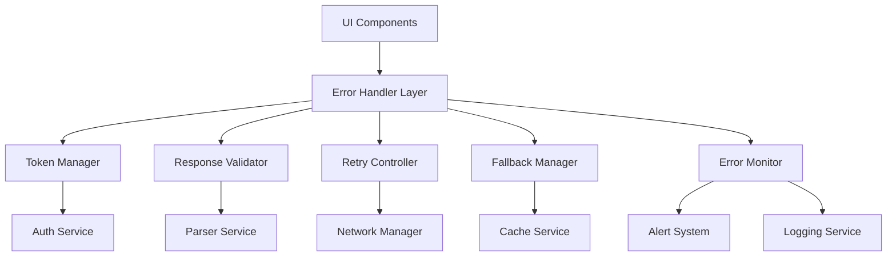

# API Error Handling and Reliability Design Document

## Overview

The API Error Handling and Reliability system provides a comprehensive solution for managing API errors, authentication token issues, and ensuring graceful degradation across the platform admin dashboard. This system addresses critical production issues including undefined token references, JSON parsing errors, network failures, and provides robust recovery mechanisms.

The system is designed as a layered architecture with centralized error handling, automatic retry mechanisms, and intelligent fallback strategies. It integrates seamlessly with the existing React-based frontend and provides both reactive error handling and proactive monitoring capabilities.

## Architecture

### High-Level Architecture



### Component Layers

1. **Presentation Layer**: React components with error boundaries
2. **Error Handling Layer**: Centralized error processing and routing
3. **Service Layer**: Specialized services for token management, validation, retry logic
4. **Infrastructure Layer**: Caching, logging, and monitoring services

## Components and Interfaces

### Core Components

#### 1. API Error Handler (`ApiErrorHandler`)
Central orchestrator for all API error handling logic.

```typescript
interface ApiErrorHandler {
  handleError(error: ApiError, context: ErrorContext): Promise<ErrorResponse>;
  registerErrorType(type: string, handler: ErrorTypeHandler): void;
  setFallbackStrategy(strategy: FallbackStrategy): void;
}

interface ApiError {
  type: 'NETWORK' | 'AUTH' | 'PARSING' | 'TIMEOUT' | 'SERVER' | 'VALIDATION';
  message: string;
  statusCode?: number;
  originalError: Error;
  context: ErrorContext;
}

interface ErrorContext {
  endpoint: string;
  method: string;
  component: string;
  userId?: string;
  timestamp: Date;
  retryCount: number;
}
```

#### 2. Token Manager (`TokenManager`)
Handles authentication token lifecycle and automatic refresh.

```typescript
interface TokenManager {
  getValidToken(): Promise<string>;
  refreshToken(): Promise<string>;
  isTokenValid(token: string): boolean;
  handleTokenError(error: AuthError): Promise<void>;
  syncTokenAcrossTabs(): void;
}

interface TokenState {
  accessToken: string | null;
  refreshToken: string | null;
  expiresAt: Date | null;
  isRefreshing: boolean;
}
```

#### 3. Response Validator (`ResponseValidator`)
Validates and sanitizes API responses before processing.

```typescript
interface ResponseValidator {
  validateResponse(response: Response): Promise<ValidationResult>;
  sanitizeData<T>(data: unknown, schema: Schema<T>): T;
  detectContentType(response: Response): ContentType;
}

interface ValidationResult {
  isValid: boolean;
  errors: ValidationError[];
  sanitizedData?: unknown;
}
```

#### 4. Retry Controller (`RetryController`)
Manages retry logic with exponential backoff and circuit breaker patterns.

```typescript
interface RetryController {
  executeWithRetry<T>(
    operation: () => Promise<T>,
    config: RetryConfig
  ): Promise<T>;
  shouldRetry(error: ApiError, attempt: number): boolean;
}

interface RetryConfig {
  maxAttempts: number;
  baseDelay: number;
  maxDelay: number;
  backoffMultiplier: number;
  retryableErrors: string[];
}
```

#### 5. Fallback Manager (`FallbackManager`)
Provides fallback data and graceful degradation strategies.

```typescript
interface FallbackManager {
  getFallbackData<T>(key: string, type: FallbackType): Promise<T | null>;
  cacheFreshData<T>(key: string, data: T): Promise<void>;
  clearStaleCache(): Promise<void>;
}

enum FallbackType {
  CACHED = 'cached',
  MOCK = 'mock',
  EMPTY_STATE = 'empty_state',
  DEFAULT = 'default'
}
```

## Data Models

### Error Models

```typescript
interface ErrorResponse {
  handled: boolean;
  fallbackData?: unknown;
  userMessage: string;
  shouldRetry: boolean;
  retryAfter?: number;
  requiresUserAction: boolean;
}

interface ErrorLog {
  id: string;
  timestamp: Date;
  error: ApiError;
  context: ErrorContext;
  resolution: ErrorResolution;
  userImpact: UserImpact;
}

enum ErrorResolution {
  RETRIED_SUCCESS = 'retried_success',
  FALLBACK_USED = 'fallback_used',
  USER_NOTIFIED = 'user_notified',
  ESCALATED = 'escalated'
}
```

### Cache Models

```typescript
interface CacheEntry<T> {
  key: string;
  data: T;
  timestamp: Date;
  expiresAt: Date;
  source: 'api' | 'fallback' | 'mock';
}

interface CacheMetadata {
  totalSize: number;
  entryCount: number;
  oldestEntry: Date;
  hitRate: number;
}
```

## Correctness Properties

*A property is a characteristic or behavior that should hold true across all valid executions of a system-essentially, a formal statement about what the system should do. Properties serve as the bridge between human-readable specifications and machine-verifiable correctness guarantees.*

<function_calls>
<invoke name="prework">
<parameter name="featureName">api-error-handling-reliability

### Property Reflection

After reviewing all properties identified in the prework analysis, several redundancies and consolidation opportunities were identified:

**Redundancy Analysis:**
- Properties 1.1, 4.1, and 4.4 all relate to response parsing and validation - these can be consolidated into a comprehensive parsing property
- Properties 1.4, 3.1, 3.2, 3.3, and 3.4 all relate to token management - these can be consolidated into token lifecycle properties
- Properties 2.1, 4.5, and 7.1 all relate to error logging - these can be consolidated into a comprehensive logging property
- Properties 5.1-5.5 are all specific examples of the same graceful degradation pattern - these can be consolidated into one comprehensive property
- Properties 6.1, 6.2, 6.4 all relate to recovery behavior - these can be consolidated into a recovery property

**Consolidated Properties:**
The following properties provide unique validation value after removing redundancy:

Property 1: JSON parsing error handling
*For any* API response containing malformed JSON, the system should catch parsing errors and provide user-friendly error messages instead of crashing
**Validates: Requirements 1.1, 4.1, 4.4**

Property 2: Network retry with exponential backoff
*For any* API call that fails due to network issues, the system should retry up to 3 times with exponential backoff timing
**Validates: Requirements 1.2**

Property 3: Token lifecycle management
*For any* authentication token state (missing, expired, invalid), the Token Manager should handle the situation appropriately by refreshing, redirecting to login, or initializing auth flow
**Validates: Requirements 1.4, 3.1, 3.2, 3.3, 3.4**

Property 4: Request timeout handling
*For any* API request that exceeds timeout thresholds, the system should cancel the request and display timeout messages
**Validates: Requirements 1.5**

Property 5: Comprehensive error logging
*For any* error that occurs in the system, complete context information should be logged for debugging purposes
**Validates: Requirements 2.1, 4.5, 7.1**

Property 6: Error message clarity
*For any* error displayed to users, the message should be clear, actionable, and appropriate for the error type
**Validates: Requirements 2.2**

Property 7: Error prioritization
*For any* set of simultaneous errors, the system should display the most critical error first based on defined priority rules
**Validates: Requirements 2.3**

Property 8: Recoverable error handling
*For any* recoverable error, the system should provide retry mechanisms or automatic recovery options
**Validates: Requirements 2.4**

Property 9: Response validation and sanitization
*For any* API response, the system should validate structure and sanitize data before processing to prevent UI breaks
**Validates: Requirements 4.2, 4.3**

Property 10: Graceful degradation
*For any* critical data that fails to load, the system should display appropriate fallback data, cached data, or empty states with clear messaging
**Validates: Requirements 1.3, 5.1, 5.2, 5.3, 5.4, 5.5**

Property 11: Cross-tab token synchronization
*For any* token state change in one browser tab, the change should be synchronized across all open tabs of the application
**Validates: Requirements 3.5**

Property 12: Automatic recovery
*For any* service that comes back online after being unavailable, the system should automatically retry failed operations and refresh stale data
**Validates: Requirements 6.1, 6.2, 6.3, 6.4, 6.5**

Property 13: Error monitoring and escalation
*For any* error pattern that exceeds defined thresholds, the system should escalate alerts and trigger diagnostic procedures
**Validates: Requirements 7.2, 7.3**

Property 14: User context collection
*For any* error encountered by a user, the system should collect relevant user context and session information
**Validates: Requirements 7.4**

Property 15: Cache management with staleness indicators
*For any* cached data displayed to users, the system should clearly indicate data freshness and manage cache storage limits intelligently
**Validates: Requirements 8.1, 8.3, 8.5**

Property 16: Offline operation queuing
*For any* critical operation attempted while offline, the system should queue the operation for retry when connectivity returns
**Validates: Requirements 8.2, 8.4**

## Error Handling

### Error Classification

The system classifies errors into the following categories with specific handling strategies:

1. **Network Errors**: Connection failures, timeouts, DNS issues
   - Strategy: Retry with exponential backoff, show network status
   
2. **Authentication Errors**: Token expiration, invalid credentials, authorization failures
   - Strategy: Automatic token refresh, redirect to login if needed
   
3. **Parsing Errors**: Malformed JSON, unexpected response format
   - Strategy: Graceful parsing with fallback, user-friendly error messages
   
4. **Server Errors**: 5xx status codes, internal server errors
   - Strategy: Retry with backoff, escalate if persistent
   
5. **Client Errors**: 4xx status codes, validation errors
   - Strategy: Show specific error messages, no retry
   
6. **Validation Errors**: Schema mismatches, missing required fields
   - Strategy: Provide defaults, sanitize data, log for debugging

### Error Recovery Strategies

```typescript
interface RecoveryStrategy {
  canRecover(error: ApiError): boolean;
  recover(error: ApiError, context: ErrorContext): Promise<RecoveryResult>;
  getFallback(error: ApiError): Promise<FallbackData>;
}

enum RecoveryType {
  RETRY = 'retry',
  REFRESH_TOKEN = 'refresh_token',
  USE_CACHE = 'use_cache',
  REDIRECT = 'redirect',
  SHOW_FALLBACK = 'show_fallback'
}
```

### Circuit Breaker Pattern

The system implements circuit breaker patterns to prevent cascading failures:

- **Closed State**: Normal operation, requests pass through
- **Open State**: Failures exceed threshold, requests fail fast
- **Half-Open State**: Limited requests allowed to test recovery

## Testing Strategy

### Dual Testing Approach

The system requires both unit testing and property-based testing to ensure comprehensive coverage:

**Unit Testing:**
- Specific error scenarios and edge cases
- Integration points between components
- Mock API responses and network conditions
- Authentication flow edge cases

**Property-Based Testing:**
- Universal properties across all error types
- Random error generation and handling verification
- Token lifecycle property validation
- Cache behavior under various conditions

**Property-Based Testing Library:**
The system will use **fast-check** for TypeScript/JavaScript property-based testing, configured to run a minimum of 100 iterations per property test.

Each property-based test must be tagged with a comment explicitly referencing the correctness property from this design document using the format: `**Feature: api-error-handling-reliability, Property {number}: {property_text}**`

**Testing Requirements:**
- Unit tests verify specific examples, edge cases, and error conditions
- Property tests verify universal properties that should hold across all inputs
- Both types provide comprehensive coverage: unit tests catch concrete bugs, property tests verify general correctness
- All tests must achieve 90%+ code coverage
- Integration tests verify end-to-end error handling flows

### Test Data Generation

Property-based tests will use intelligent generators for:
- Malformed JSON responses
- Network failure scenarios
- Token expiration states
- API response variations
- Cache state combinations
- Error timing and sequencing

## Implementation Architecture

### Service Integration

The error handling system integrates with existing services:

1. **AuthContext**: Enhanced with robust token management
2. **API Client**: Wrapped with error handling middleware
3. **React Components**: Enhanced with error boundaries
4. **Local Storage**: Used for caching and token persistence
5. **Logging Service**: Centralized error logging and monitoring

### Performance Considerations

- **Lazy Loading**: Error handling components loaded on demand
- **Debouncing**: Prevent rapid retry attempts
- **Memory Management**: Intelligent cache pruning
- **Background Processing**: Non-blocking error recovery

### Security Considerations

- **Token Security**: Secure token storage and transmission
- **Error Information**: Sanitize error messages to prevent information leakage
- **Audit Trail**: Comprehensive logging for security analysis
- **Rate Limiting**: Prevent abuse of retry mechanisms

### Monitoring and Observability

The system provides comprehensive monitoring capabilities:

- **Error Metrics**: Frequency, types, resolution times
- **Performance Metrics**: Retry success rates, fallback usage
- **User Impact**: Error impact on user experience
- **System Health**: Overall error handling system status

This design ensures robust error handling while maintaining system performance and user experience quality.