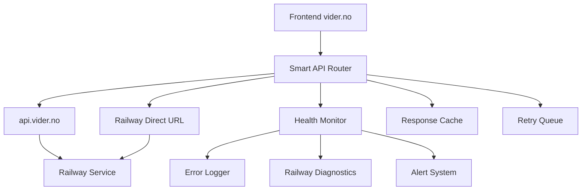

# Railway API Connectivity Fix Design

## Overview

This design addresses critical 502 "Bad Gateway" errors occurring when accessing platform admin API endpoints through the custom domain api.vider.no. The solution implements intelligent request routing, comprehensive error handling, health monitoring, and fallback mechanisms to ensure reliable access to platform admin functionality.

## Architecture

The system consists of several interconnected components:



## Components and Interfaces

### Smart API Router

The Smart API Router is the central component that manages request routing and fallback logic.

```typescript
interface SmartApiRouter {
  // Primary routing method
  makeRequest<T>(endpoint: string, options: RequestOptions): Promise<ApiResponse<T>>;
  
  // Health monitoring
  checkEndpointHealth(url: string): Promise<HealthStatus>;
  
  // Fallback management
  switchToFallback(): void;
  switchToPrimary(): void;
  
  // Configuration
  configure(config: RouterConfig): void;
}

interface RouterConfig {
  primaryUrl: string;
  fallbackUrl: string;
  maxRetries: number;
  retryDelay: number;
  healthCheckInterval: number;
  failureThreshold: number;
}

interface HealthStatus {
  url: string;
  status: 'healthy' | 'degraded' | 'unhealthy';
  responseTime: number;
  lastChecked: Date;
  errorRate: number;
}
```

### Railway Health Monitor

Monitors Railway service health and custom domain connectivity.

```typescript
interface RailwayHealthMonitor {
  // Health checking
  checkRailwayService(): Promise<ServiceHealth>;
  checkCustomDomain(): Promise<DomainHealth>;
  checkDnsResolution(): Promise<DnsHealth>;
  
  // Monitoring
  startMonitoring(): void;
  stopMonitoring(): void;
  
  // Event handling
  onHealthChange(callback: (health: HealthStatus) => void): void;
  onError(callback: (error: RailwayError) => void): void;
}

interface ServiceHealth {
  railwayStatus: 'operational' | 'degraded' | 'down';
  edgeLocation: string;
  responseTime: number;
  lastDeployment: Date;
}

interface DomainHealth {
  dnsResolution: 'success' | 'failed';
  sslCertificate: 'valid' | 'invalid' | 'expired';
  edgeRouting: 'working' | 'failed';
}
```

### Error Handler and Logger

Comprehensive error handling with Railway-specific diagnostics.

```typescript
interface RailwayErrorHandler {
  // Error handling
  handleGatewayError(error: GatewayError): Promise<ErrorResponse>;
  handleCorsError(error: CorsError): Promise<ErrorResponse>;
  handleTimeoutError(error: TimeoutError): Promise<ErrorResponse>;
  
  // Logging
  logRailwayError(error: RailwayError): void;
  logDiagnostics(diagnostics: RailwayDiagnostics): void;
  
  // Recovery
  attemptRecovery(error: RailwayError): Promise<RecoveryResult>;
}

interface RailwayError {
  type: 'gateway' | 'cors' | 'timeout' | 'dns' | 'ssl';
  statusCode: number;
  message: string;
  url: string;
  headers: Record<string, string>;
  timestamp: Date;
  railwayHeaders: RailwayHeaders;
}

interface RailwayHeaders {
  edgeLocation?: string;
  requestId?: string;
  deploymentId?: string;
}
```

### Fallback Strategy Manager

Manages intelligent fallback routing and recovery.

```typescript
interface FallbackStrategyManager {
  // Strategy management
  activateFallback(reason: string): void;
  deactivateFallback(): void;
  
  // URL management
  getCurrentUrl(): string;
  getAvailableUrls(): string[];
  
  // State management
  getFallbackState(): FallbackState;
  onStateChange(callback: (state: FallbackState) => void): void;
}

interface FallbackState {
  isActive: boolean;
  currentUrl: string;
  reason: string;
  activatedAt: Date;
  attemptedRecovery: number;
}
```

## Data Models

### Request Configuration

```typescript
interface RequestOptions {
  method: 'GET' | 'POST' | 'PUT' | 'DELETE' | 'PATCH' | 'OPTIONS';
  headers?: Record<string, string>;
  body?: any;
  timeout?: number;
  retries?: number;
  fallbackEnabled?: boolean;
}

interface ApiResponse<T> {
  data: T;
  status: number;
  headers: Record<string, string>;
  url: string;
  timing: ResponseTiming;
}

interface ResponseTiming {
  dns: number;
  connect: number;
  ssl: number;
  send: number;
  wait: number;
  receive: number;
  total: number;
}
```

### Error Models

```typescript
interface GatewayError extends Error {
  statusCode: 502;
  gatewayType: 'railway-edge' | 'cloudflare' | 'unknown';
  upstreamError?: string;
}

interface CorsError extends Error {
  origin: string;
  requestedHeaders: string[];
  allowedOrigins: string[];
}

interface TimeoutError extends Error {
  timeout: number;
  elapsed: number;
  phase: 'dns' | 'connect' | 'ssl' | 'send' | 'receive';
}
```

## Correctness Properties

*A property is a characteristic or behavior that should hold true across all valid executions of a system-essentially, a formal statement about what the system should do. Properties serve as the bridge between human-readable specifications and machine-verifiable correctness guarantees.*

### Property 1: Request routing reliability
*For any* API request, when the primary URL fails with a 502 error, the Smart API Router should automatically attempt the request using the fallback URL
**Validates: Requirements 1.2, 1.4**

### Property 2: CORS header consistency
*For any* cross-origin request from vider.no to api.vider.no, the response should include proper Access-Control-Allow-Origin headers
**Validates: Requirements 2.1, 2.2, 2.3**

### Property 3: Health monitoring accuracy
*For any* endpoint health check, the reported status should accurately reflect the actual endpoint availability and response time
**Validates: Requirements 3.1, 3.2, 3.4**

### Property 4: Fallback state consistency
*For any* fallback activation, the system should maintain consistent authentication state and session continuity across URL switches
**Validates: Requirements 4.3, 4.4**

### Property 5: Error logging completeness
*For any* 502 error occurrence, the system should log all relevant diagnostic information including Railway headers, timing, and request details
**Validates: Requirements 5.1, 5.2, 5.3**

### Property 6: Graceful degradation preservation
*For any* API endpoint failure, the system should provide alternative functionality or cached data without complete feature loss
**Validates: Requirements 6.1, 6.2, 6.3, 6.4**

### Property 7: Status communication clarity
*For any* infrastructure issue, the system should provide clear, actionable status messages that distinguish between infrastructure and application problems
**Validates: Requirements 7.1, 7.2, 7.3**

### Property 8: Automatic recovery behavior
*For any* service restoration after failure, the system should automatically detect recovery and switch back to optimal routing
**Validates: Requirements 1.5, 4.5, 8.5**

## Error Handling

### 502 Gateway Errors
- Immediate retry with exponential backoff
- Automatic fallback to direct Railway URL
- Detailed logging of Railway edge headers
- User notification of infrastructure issues

### CORS Failures
- Preflight request validation
- Header configuration verification
- Origin whitelist management
- Credential handling validation

### DNS and SSL Issues
- DNS resolution monitoring
- SSL certificate validation
- Edge routing verification
- Automatic failover to IP addresses

### Timeout Handling
- Phase-specific timeout detection
- Progressive timeout increases
- Connection pooling optimization
- Request queuing during outages

## Testing Strategy

### Unit Tests
- Smart API Router configuration and routing logic
- Health Monitor status detection and reporting
- Error Handler classification and recovery
- Fallback Strategy state management

### Property-Based Tests
- Request routing under various failure scenarios
- CORS header generation for different origins
- Health status accuracy across different service states
- Error logging completeness for all error types
- Fallback behavior consistency during state transitions

### Integration Tests
- End-to-end request routing through both URLs
- Railway service interaction and header parsing
- DNS and SSL validation workflows
- Cross-browser CORS compatibility

### Load Tests
- High-volume request routing performance
- Fallback switching under load
- Health monitoring accuracy during stress
- Error handling performance impact

The testing approach ensures comprehensive coverage of Railway-specific infrastructure challenges while maintaining high reliability for platform admin operations.