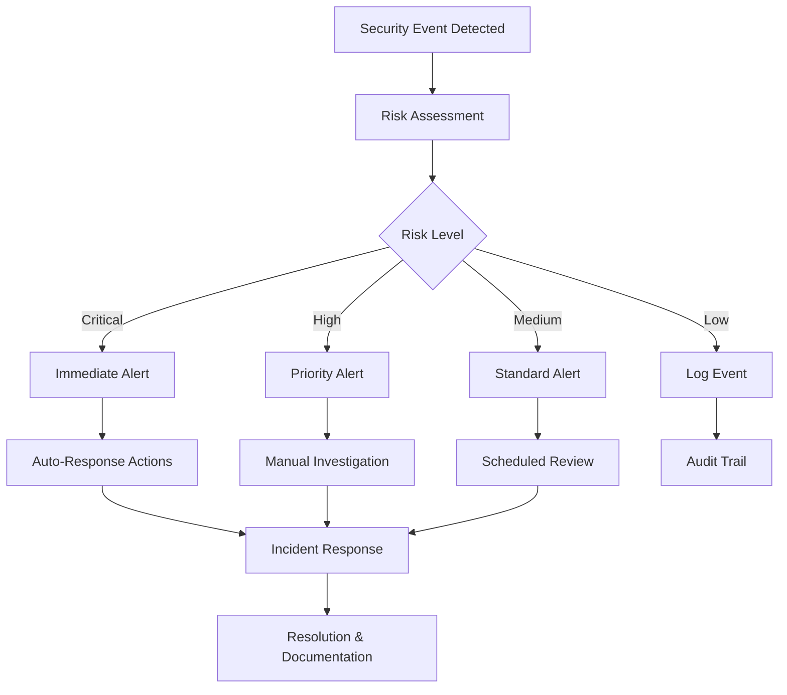

# Platform Admin Security Documentation

## Overview

Security is a critical aspect of the Platform Admin Dashboard. This documentation covers all security features, best practices, and compliance requirements for managing the Vider Transport Marketplace platform safely and securely.

## Security Architecture

### Multi-Layer Security Model

```
┌─────────────────────────────────────────────────────────────┐
│                    Application Layer                        │
│  • Role-Based Access Control (RBAC)                       │
│  • Input Validation & Sanitization                        │
│  • Rate Limiting & DDoS Protection                        │
└─────────────────────────────────────────────────────────────┘
┌─────────────────────────────────────────────────────────────┐
│                   Authentication Layer                      │
│  • JWT Token Authentication                                │
│  • Multi-Factor Authentication (MFA)                      │
│  • Session Management                                      │
└─────────────────────────────────────────────────────────────┘
┌─────────────────────────────────────────────────────────────┐
│                    Transport Layer                          │
│  • TLS/SSL Encryption                                     │
│  • Certificate Pinning                                    │
│  • Secure Headers                                         │
└─────────────────────────────────────────────────────────────┘
┌─────────────────────────────────────────────────────────────┐
│                      Data Layer                             │
│  • Database Encryption at Rest                            │
│  • Field-Level Encryption                                 │
│  • Backup Encryption                                      │
└─────────────────────────────────────────────────────────────┘
```

## Authentication & Authorization

### JWT Authentication

The platform uses JSON Web Tokens (JWT) for secure authentication:

```typescript
// JWT Token Structure
{
  "header": {
    "alg": "RS256",
    "typ": "JWT"
  },
  "payload": {
    "sub": "user-id",
    "role": "PLATFORM_ADMIN",
    "permissions": ["user:read", "user:write", "company:manage"],
    "iat": 1640995200,
    "exp": 1641081600,
    "iss": "vider-platform"
  }
}
```

### Role-Based Access Control (RBAC)

#### Role Hierarchy

1. **Platform Admin** (Highest Privilege)
   - Full access to all platform features
   - User and company management
   - Financial operations and analytics
   - Security monitoring and configuration
   - System administration

2. **Company Admin** (Limited Privilege)
   - Access to own company data only
   - User management within company
   - Company-specific analytics
   - Limited financial data access

3. **Company User** (Lowest Privilege)
   - Access to own profile only
   - Basic platform functionality
   - No administrative capabilities

#### Permission Matrix

| Resource | Platform Admin | Company Admin | Company User |
|----------|---------------|---------------|--------------|
| Users (All) | CRUD | - | - |
| Users (Own Company) | CRUD | CRUD | R (Self) |
| Companies (All) | CRUD | - | - |
| Companies (Own) | CRUD | RU | R |
| Financial (All) | CRUD | - | - |
| Financial (Own) | CRUD | R | - |
| Analytics (Platform) | R | - | - |
| Analytics (Company) | R | R | - |
| Security Monitoring | CRUD | - | - |
| System Config | CRUD | - | - |

### Multi-Factor Authentication (MFA)

MFA is required for all platform admin accounts:

#### Supported MFA Methods
1. **TOTP (Time-based One-Time Password)**
   - Google Authenticator
   - Authy
   - Microsoft Authenticator

2. **SMS-based OTP**
   - Backup method for TOTP
   - Rate-limited to prevent abuse

3. **Hardware Security Keys**
   - FIDO2/WebAuthn compatible
   - YubiKey support

#### MFA Configuration

```typescript
// Enable MFA for user
POST /api/platform-admin/auth/mfa/enable
{
  "method": "totp",
  "secret": "base32-encoded-secret"
}

// Verify MFA setup
POST /api/platform-admin/auth/mfa/verify
{
  "token": "123456"
}
```

## Security Monitoring

### Real-Time Threat Detection

The platform continuously monitors for security threats:

#### Monitored Events

1. **Authentication Events**
   - Failed login attempts
   - Suspicious login patterns
   - Account lockouts
   - Password reset requests

2. **Authorization Events**
   - Privilege escalation attempts
   - Unauthorized access attempts
   - Permission violations
   - Role changes

3. **Data Access Events**
   - Bulk data exports
   - Sensitive data access
   - Unusual query patterns
   - Data modification attempts

4. **System Events**
   - Configuration changes
   - System errors
   - Performance anomalies
   - Resource exhaustion

### Security Alert System

#### Alert Types

1. **Critical Alerts** (Immediate Response Required)
   - Multiple failed admin logins
   - Privilege escalation attempts
   - Data breach indicators
   - System compromise signs

2. **High Priority Alerts**
   - Suspicious user behavior
   - Unusual access patterns
   - Failed security validations
   - Policy violations

3. **Medium Priority Alerts**
   - Rate limit violations
   - Configuration warnings
   - Performance degradation
   - Audit log anomalies

4. **Low Priority Alerts**
   - Information events
   - Routine notifications
   - System maintenance alerts
   - Usage statistics

#### Alert Response Workflow



### Audit Logging

#### Comprehensive Audit Trail

All administrative actions are logged with complete context:

```json
{
  "id": "audit-log-id",
  "timestamp": "2024-01-15T10:30:00Z",
  "adminUserId": "admin-user-id",
  "action": "USER_ROLE_UPDATE",
  "entityType": "User",
  "entityId": "target-user-id",
  "changes": {
    "role": {
      "from": "COMPANY_USER",
      "to": "COMPANY_ADMIN"
    }
  },
  "reason": "Promotion to company admin role",
  "ipAddress": "192.168.1.100",
  "userAgent": "Mozilla/5.0...",
  "sessionId": "session-id",
  "requestId": "request-id",
  "metadata": {
    "companyId": "company-id",
    "approvedBy": "senior-admin-id"
  }
}
```

#### Audit Log Categories

1. **User Management**
   - User creation, updates, deletions
   - Role assignments and changes
   - Account suspensions and activations
   - Password resets and security changes

2. **Company Management**
   - Company verifications and rejections
   - Status changes and suspensions
   - Document uploads and reviews
   - Compliance actions

3. **Financial Operations**
   - Transaction reviews and modifications
   - Refund processing
   - Commission rate changes
   - Financial report generation

4. **Security Actions**
   - Security alert responses
   - Incident investigations
   - Policy updates
   - Access control changes

5. **System Administration**
   - Configuration changes
   - Feature toggle updates
   - Backup operations
   - Maintenance activities

## Data Protection

### Encryption Standards

#### Data at Rest
- **Database Encryption**: AES-256 encryption for all sensitive data
- **File Storage**: Encrypted file system with key rotation
- **Backup Encryption**: All backups encrypted with separate keys
- **Key Management**: Hardware Security Module (HSM) for key storage

#### Data in Transit
- **TLS 1.3**: All API communications encrypted
- **Certificate Pinning**: Prevent man-in-the-middle attacks
- **Perfect Forward Secrecy**: Ephemeral key exchange
- **HSTS**: HTTP Strict Transport Security headers

#### Field-Level Encryption

Sensitive fields are encrypted at the application level:

```typescript
// Encrypted fields
const encryptedFields = [
  'user.personalId',
  'user.bankAccount',
  'company.taxId',
  'transaction.cardNumber',
  'document.content'
];

// Encryption implementation
class FieldEncryption {
  encrypt(value: string): string {
    return AES.encrypt(value, this.getEncryptionKey()).toString();
  }
  
  decrypt(encryptedValue: string): string {
    return AES.decrypt(encryptedValue, this.getEncryptionKey()).toString();
  }
}
```

### Data Masking

Non-production environments use data masking:

```sql
-- Production data masking for development
UPDATE users SET 
  email = CONCAT('user', id, '@example.com'),
  phone = '+47' || LPAD(FLOOR(RANDOM() * 100000000)::text, 8, '0'),
  personal_id = NULL
WHERE environment = 'development';
```

## Compliance & Regulations

### GDPR Compliance

#### Data Subject Rights

1. **Right to Access**
   - Users can request all personal data
   - Automated data export functionality
   - Response within 30 days

2. **Right to Rectification**
   - Users can correct inaccurate data
   - Admin tools for data correction
   - Audit trail for all changes

3. **Right to Erasure**
   - "Right to be forgotten" implementation
   - Secure data deletion procedures
   - Retention policy enforcement

4. **Right to Data Portability**
   - Structured data export formats
   - Machine-readable formats (JSON, CSV)
   - Secure transfer mechanisms

#### Data Processing Lawfulness

- **Consent**: Explicit consent for data processing
- **Contract**: Processing necessary for contract performance
- **Legal Obligation**: Compliance with legal requirements
- **Legitimate Interest**: Balanced against data subject rights

### Norwegian Data Protection

#### Datatilsynet Compliance
- Registration with Norwegian Data Protection Authority
- Regular compliance assessments
- Incident reporting procedures
- Privacy impact assessments

#### Local Data Requirements
- Data residency within EU/EEA
- Norwegian language privacy notices
- Local data protection officer appointment

### Financial Regulations

#### PCI DSS Compliance
- Secure payment card data handling
- Regular security assessments
- Network segmentation
- Access control measures

#### Anti-Money Laundering (AML)
- Customer due diligence procedures
- Transaction monitoring
- Suspicious activity reporting
- Record keeping requirements

## Incident Response

### Incident Classification

#### Severity Levels

1. **Critical (P1)**
   - Data breach or unauthorized access
   - System compromise
   - Service unavailability
   - Response time: Immediate (< 15 minutes)

2. **High (P2)**
   - Security vulnerability exploitation
   - Significant data exposure
   - Major functionality impairment
   - Response time: < 1 hour

3. **Medium (P3)**
   - Minor security incidents
   - Limited data exposure
   - Partial functionality issues
   - Response time: < 4 hours

4. **Low (P4)**
   - Security warnings
   - Performance degradation
   - Minor functionality issues
   - Response time: < 24 hours

### Response Procedures

#### Immediate Response (0-15 minutes)
1. **Incident Detection**
   - Automated alert systems
   - Manual reporting
   - Third-party notifications

2. **Initial Assessment**
   - Severity classification
   - Impact assessment
   - Stakeholder notification

3. **Containment**
   - Isolate affected systems
   - Prevent further damage
   - Preserve evidence

#### Investigation Phase (15 minutes - 4 hours)
1. **Evidence Collection**
   - System logs and audit trails
   - Network traffic analysis
   - User activity records

2. **Root Cause Analysis**
   - Technical investigation
   - Process review
   - Timeline reconstruction

3. **Impact Assessment**
   - Data affected
   - Users impacted
   - Business consequences

#### Resolution Phase (4-24 hours)
1. **Remediation Actions**
   - Security patches
   - Configuration changes
   - Process improvements

2. **Recovery Procedures**
   - System restoration
   - Data recovery
   - Service resumption

3. **Verification**
   - Security testing
   - Functionality validation
   - Performance monitoring

#### Post-Incident Activities (24-72 hours)
1. **Documentation**
   - Incident report
   - Lessons learned
   - Process updates

2. **Communication**
   - Stakeholder updates
   - Regulatory notifications
   - Public disclosure (if required)

3. **Prevention Measures**
   - Security improvements
   - Process enhancements
   - Training updates

## Security Best Practices

### For Platform Administrators

#### Account Security
- Use strong, unique passwords
- Enable multi-factor authentication
- Regular password updates
- Secure password storage

#### Access Management
- Follow principle of least privilege
- Regular access reviews
- Immediate revocation for terminated users
- Segregation of duties

#### Operational Security
- Secure workstation configuration
- VPN usage for remote access
- Regular security training
- Incident reporting procedures

### For Developers

#### Secure Coding
- Input validation and sanitization
- Output encoding
- SQL injection prevention
- Cross-site scripting (XSS) protection

#### Code Review
- Security-focused code reviews
- Automated security scanning
- Dependency vulnerability checks
- Static code analysis

#### Testing
- Security testing in CI/CD pipeline
- Penetration testing
- Vulnerability assessments
- Security regression testing

## Security Monitoring Tools

### Built-in Security Features

1. **Security Dashboard**
   - Real-time threat monitoring
   - Security metrics and KPIs
   - Alert management interface
   - Incident tracking

2. **Audit Log Viewer**
   - Comprehensive audit trail
   - Advanced search and filtering
   - Export capabilities
   - Compliance reporting

3. **User Activity Monitor**
   - Real-time user activity
   - Behavioral analysis
   - Anomaly detection
   - Risk scoring

### External Integrations

1. **SIEM Integration**
   - Splunk connector
   - ELK Stack integration
   - Custom log forwarding
   - Real-time alerting

2. **Vulnerability Scanning**
   - Automated security scans
   - Dependency checking
   - Infrastructure assessment
   - Compliance validation

3. **Threat Intelligence**
   - External threat feeds
   - IP reputation services
   - Malware detection
   - Behavioral analytics

## Security Configuration

### Environment Variables

```bash
# Authentication Settings
JWT_SECRET=your-jwt-secret-key
JWT_EXPIRATION=24h
MFA_REQUIRED=true
SESSION_TIMEOUT=30m

# Security Headers
ENABLE_HSTS=true
ENABLE_CSP=true
ENABLE_FRAME_OPTIONS=true
ENABLE_XSS_PROTECTION=true

# Rate Limiting
RATE_LIMIT_WINDOW=15m
RATE_LIMIT_MAX_REQUESTS=100
RATE_LIMIT_SKIP_SUCCESSFUL_REQUESTS=false

# Encryption
ENCRYPTION_KEY=your-encryption-key
FIELD_ENCRYPTION_ENABLED=true
DATABASE_ENCRYPTION_ENABLED=true

# Monitoring
SECURITY_MONITORING_ENABLED=true
AUDIT_LOG_RETENTION_DAYS=2555
ALERT_NOTIFICATION_ENABLED=true
```

### Security Headers Configuration

```typescript
// Security headers middleware
app.use((req, res, next) => {
  // HTTP Strict Transport Security
  res.setHeader('Strict-Transport-Security', 'max-age=31536000; includeSubDomains');
  
  // Content Security Policy
  res.setHeader('Content-Security-Policy', "default-src 'self'; script-src 'self' 'unsafe-inline'");
  
  // X-Frame-Options
  res.setHeader('X-Frame-Options', 'DENY');
  
  // X-Content-Type-Options
  res.setHeader('X-Content-Type-Options', 'nosniff');
  
  // X-XSS-Protection
  res.setHeader('X-XSS-Protection', '1; mode=block');
  
  // Referrer Policy
  res.setHeader('Referrer-Policy', 'strict-origin-when-cross-origin');
  
  next();
});
```

## Security Checklist

### Pre-Deployment Security Checklist

- [ ] All dependencies updated to latest secure versions
- [ ] Security headers properly configured
- [ ] Authentication and authorization implemented
- [ ] Input validation and sanitization in place
- [ ] SQL injection protection enabled
- [ ] XSS protection implemented
- [ ] CSRF protection configured
- [ ] Rate limiting enabled
- [ ] Audit logging functional
- [ ] Error handling secure (no information leakage)
- [ ] Encryption at rest and in transit
- [ ] Security monitoring active
- [ ] Backup and recovery procedures tested
- [ ] Incident response plan documented
- [ ] Security training completed

### Regular Security Maintenance

#### Weekly Tasks
- [ ] Review security alerts and incidents
- [ ] Check audit logs for anomalies
- [ ] Verify backup integrity
- [ ] Update security documentation

#### Monthly Tasks
- [ ] Security vulnerability assessment
- [ ] Access review and cleanup
- [ ] Security metrics analysis
- [ ] Incident response plan review

#### Quarterly Tasks
- [ ] Penetration testing
- [ ] Security training updates
- [ ] Compliance assessment
- [ ] Disaster recovery testing

#### Annual Tasks
- [ ] Comprehensive security audit
- [ ] Risk assessment update
- [ ] Security policy review
- [ ] Regulatory compliance certification

For additional security resources and support, contact the security team at security@vider.no.